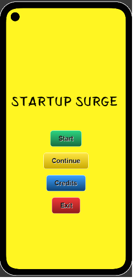
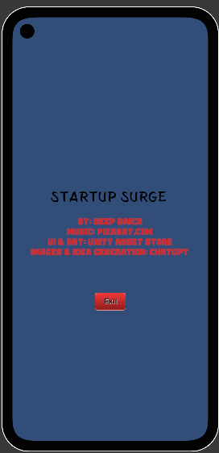

# 🚀 Startup Surge (Unity 2D)

**Startup Surge** is an addictive 2D idle/tycoon-style game where you hire employees, upgrade systems, and rack up passive income — all wrapped in a clean UI, fluid animations, and satisfying game loops. Built solo in Unity using C#.

---

## 📲 Download & Play

🔗 [Download APK](https://drive.google.com/file/d/1qjkxA-I66kdsM2i_AZ-3Sp3yjDCsARMV/view?usp=drive_link) — Install it directly on your Android device and try it out!

---

## 🎮 Game Features

- 💰 **Click-to-Earn** mechanic with upgrade scaling
- 🧍‍♂️ **Smart Hiring** across two dynamic zones (A & B)
- 💼 **15 Unique Employee Positions** with zone-based prefabs
- 📈 **Passive Income** tied to employee count and upgrades
- 🎥 **Smooth Camera Focus** on new hires with auto-reset
- 🔄 **Scene Transitions** (Main Menu → Game → Credits → End)
- 🧠 **End Game Logic** triggers after all 15 hires are filled
- 🔊 **Persistent Background Music** across scenes
- 💬 **Popup Feedback UI** using animations
- 🎨 **Minimalist UI** built with TextMeshPro

---

## 🛠️ Built With

- 🎮 Unity Engine (2D)
- 💻 C#
- 🧩 TextMeshPro
- 🔉 Unity Audio System
- 🖱 Unity UI Toolkit

---

## 🧠 Core Game Logic

| Feature                  | Description                                                                 |
|--------------------------|-----------------------------------------------------------------------------|
| Smart Employee Spawning  | Prefabs auto-assign to 15 positions across Zones A & B                      |
| Progressive Upgrades     | Hiring/upgrades get costlier with each action                               |
| Dynamic Camera Control   | Smooth camera pans to new employees, then resets to default                 |
| Prefab Variety           | Unique visuals per spawn point to create replay value                       |

---

## 📸 Preview

## 🎬 Scenes Overview

- 🎬 **Main Menu** – Title screen with Start, Continue, Credits, Exit  
- 🎮 **Game Scene** – Core gameplay: cash, employees, upgrades  
- 📝 **Credits** – Developer credits and exit  
- 🏁 **End Game Panel** – Triggered when all employees are hired

---

## 🧩 Key Scripts

- `GameManager.cs` – Controls game state, money, hiring
- `GameEnd.cs` – Triggers end state logic
- `StartGameButton.cs`, `CreditButton.cs`, `ExitButton.cs` – Handles menu navigation
- `CoinPopup.cs`, `PopupText.cs` – Feedback for earning/spending
- `BackgroundMusic.cs` – Keeps audio consistent across scenes
- `EmployeeCoinSpawner.cs` – Spawns coins from employees
- `AutoScroll.cs` – UI scroll behavior for credits

---

## 📸 Screenshots

 

 

 |

---

## 👨‍💻 Developed By

**Deep Darji**  
🖥 [Portfolio](https://deepdarji.github.io) | 🐙 [GitHub](https://github.com/DeepDarji)  

---

⭐ If you liked it or have suggestions to improve — feel free to open an issue or drop a ⭐ on the repo!

